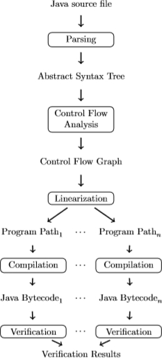
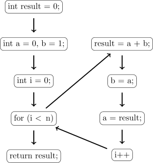

# Contents

---

# Goals

---

# The Running Example
Let us use the fibonacci sequence as a running example:

```java
int fib(int n) {
    int result = 0;
    int a = 0, b = 1;
    for (int i = 0; i < n; i++) {
        result = a + b;
        b = a;
        a = result;
    }
    return result;
}
```

---

# The Running Example - Binet's Fibonacci number formula

We can use Binet's Fibonacci number formula to verify that our algorithm is correct.

\begin{equation*}
    F_n = \dfrac{(1+ \sqrt{5})^n - (1 - \sqrt{5})^n}{2^n \sqrt{5}}
\end{equation*}

where $F_n$ is the $n$th term in the fibonacci sequence.

---

# Architecture

{ }

---

# Control Flow Analysis

The first step after parsing is constructing the Control Flow Graph (CFG). The CFG 
is a data structure containing the flow of the program to be analyzed.

. . .

Let $G=(V,E)$ be a graph where the nodes are the statements of the program and the 
edges are the possible flows between these statements.

---

# Control Flow Analysis - The CFG of Fibonacci



---

# Path Unfolding

---

# Path Unfolding - Two Subsequent Statements

---

# Path Unfolding - If-Then-Else Statements

---

# Path Unfolding - Loops

---

# Compilation

---

# Verification

---

# Experiments

---

# Conclusion

---

# Questions


<!-- Local Variables:  -->
<!-- pandoc/write: beamer -->
<!-- pandoc/pdf-engine: "xelatex" -->
<!-- pandoc/template: "beamer-template.tex" -->
<!-- End:  -->