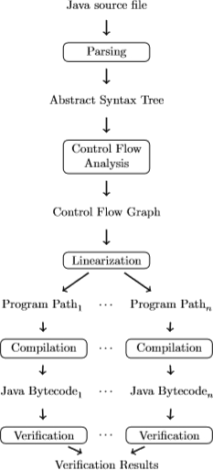
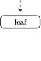
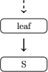
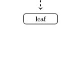
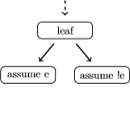
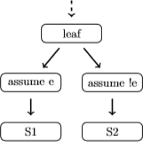
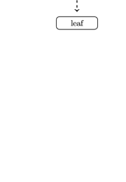
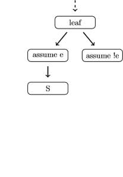
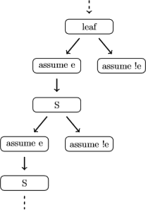

# Contents

* An introduction to formal verification.
* The goal of the project.
* The implementation.
  * The architecture.
  * Control flow analysis.
  * The execution tree.
  * Compilation.
  * Verification.
* Experiments.
* My experience.
* Conclusion.

---

# An introduction to formal verification

## An introduction to formal verification

---

# An introduction to formal verification

Formal verification tries to automatically verify if a program satisfies its specification.

. . .

This specification can be in terms of functionality, for example: given a Hoare triple $$\{P\} \enskip S \enskip \{Q\}$$ is $Q$ a valid formula when assuming that $P$ holds after executing $S$?

. . .

Or in terms of safety properties, for example: is it possible that a division by zero occurs during the execution of $S$?

---

# An introduction to formal verification - Assertions and assumptions

Assertions and assumptions are used to instruct the verification back-end.

. . .

`assert e`{.java} is a statement that instructs the verification back-end to verify if `e`{.java} is a valid formula at this point in the execution.

. . .

`assume e`{.java} is a statement that instructs the verification back-end to assume that `e`{.java} holds for the rest of the execution.

. . .

For example, branching statements are statements which are translated into assumptions.

---

# An introduction to formal verification - An example

Suppose we have a function `int min(int x, int y)`{.java} that returns the minimum of its two arguments. Its specification can be written as:
$$\{true\} \enskip min(x, y) \enskip \{retval \leq x \wedge retval \leq y\} $$
where $retval$ is the return value of the method call.

. . .

This could be written in Java as:

```java
int min(int x, int y) {
    CProver.Assume(true); // Not necessary, but to be specific.
    int retval = x < y ? x : y;
    assert retval <= x && retval <= y;
    return retval;
}
```

---

# An introduction to formal verification - JBMC

We use JBMC as the verification back-end of our tool.

JBMC is an formal verification tool for Java Bytecode, based on symbolic model checking. It supports:

* The verification of user-defined assertions.
* Verifying that an exception never occurs.

---

# The experimentation project

## The experimentation project

---

# The goal of the project

Develop a verification tool that can verify non-concurrent programs written in Java.

That is, given a Java program with assertions and assumptions, verify if these assertions hold under those assumptions.

The idea is that when using our tool, new optimization ideas can be implemented more easily than using JBMC directly.

---

# The supported Java subset

Only a subset of the Java language is supported:

* Classes containing methods and fields.
  * No inheritance or interfaces.
* Methods and constructors containing (non-concurrency related) statements.
* All expressions, except lambdas and casting.

---

# The architecture

{ height=70% width=70% }

---

# The architecture - A change of course

Initially, we aimed to compile into the C language. C can model Java well in some aspects, except for a some higher-level features.

* Arrays are a lot more low-level in C, but can be modelled.
* Exceptions cannot be modelled easily in C.

---

# The control flow analysis

## The second phase: control flow analysis

---

# The control flow analysis

The Control Flow Graph (CFG) is a directed graph $G=(V,E)$ where the nodes are the statements of the program and the edges are the possible flows between the statements.

The CFG is constructed using a control flow analysis, which is relatively straightforward. Although the construction can become difficult when we have a complex method call expression, for example: `f(g(), h())`{.java}.

---

# The control flow analysis - The construction

We base our approach on that described by Nielson et al. in Principles of Program Analysis.

The construction of the control flow graph roughly goes as follows: suppose each statement has an unique (integer) label $l$.

We define the two functions:
\begin{align*}
    init &: Statement \rightarrow Label \\
    final &: Statement \rightarrow Labels
\end{align*}
The $init$ function defines the entry point of a statement, and the $final$ function defines the exit points of a statement.

---

# The control flow analysis - A simple statement

For a simple (non-branching) statement, like a variable declaration `int x;`{.java} we have:
\begin{align*}
    init(declare(\tau, x)^l)  &= l \\
    final(declare(\tau, x)^l) &= \{l\}
\end{align*}
where $\tau$ is the type of the variable named $x$.

. . .

And the control flow is empty:
$$flow(declare(\tau, x)^l) = \emptyset$$

---

# The control flow analysis - An if-then-else statement

For an if-then-else statement we have:
\begin{align*}
    init(ite(g, S1, S2)^l) &= l \\
    final(ite(g, S1, S2)^l) &= final(S1) \cup final(S2)
\end{align*}
where $g$ is the guard, $S1$ is the body of the true branch, and $S2$ is the body of the false branch.

. . .

We then construct the control flow by connecting up the if-then-else statement with the init of both the branches and add the control flow of both $S1$ and $S2$, i.e.:
\begin{align*}
    flow(ite(g,S1,S2)^l) &= \{(l, init(S1)), (l, init(S2))\} \\
                         &\cup flow(S1) \cup flow(S2)
\end{align*}

---

# The control flow analysis - Two subsequent statements

For two statements executed one after another we have:
\begin{align*}
    init(seq(S1, S2)) &= init(S1) \\
    final(seq(S1, S2)) &= final(S2)
\end{align*}

. . .

We construct the control flow by connecting the first statement with the second statement and add the control flow of both $S1$ and $S2$, i.e.:
\begin{align*}
    flow(seq(S1, S2)) &= \{(l, init(S2) \mid l \in final(S1)\} \\
                      &\cup flow(S1) \cup flow(S2)
\end{align*}

---

# The control flow analysis - Constructing the CFG

Then suppose we have a program contains methods $M_1$, $\dots$, $M_n$ with bodies $S_1$, $\dots$, $S_n$.

We construct the control flow graph by computing the control flow of every method body, and gather the nodes from the edges:

\begin{align*}
    E = \bigcup_{i=1}^n flow(S_i) \\ \\
    V = \bigcup_{(v,w) \in E}\{v,w\}
\end{align*}

---

# Constructing the execution tree

## The third phase: constructing the execution tree

---

# Constructing the execution tree

The Execution Tree is a tree that contains all possible executions of a program from the entry point until the exit point. It is similar to the CFG, but the cycles are unfolded.

. . .

The number of possible executions can be infinite when the program contains loops or recursion.

. . .

A common approach to bound the possible executions is to only look at the executions from the entry point to the exit point that have maximum length $k$.

---

# Constructing the execution tree - A simple statement

::: columns

:::: column
Constructing the Execution Tree for a simple (non-branching) statement: `S;`{.java}

For each leaf in the execution tree, ...

::::

:::: column

::::

:::

---

# Constructing the execution tree - A simple statement

::: columns

:::: column
Constructing the Execution Tree for a simple (non-branching) statement: `S;`{.java}

For each leaf in the execution tree, we add a new node containing `S` and add
an edge from the leaf to the new node.

::::

:::: column

::::

:::

---

# Constructing the execution tree - An if-then-else statement

::: columns

:::: column

Constructing the Execution Tree for an if-then-else statement: `if (e) S1; else S2;`{.java}

For each leaf in the execution tree, we ...

::::

:::: column

::::

:::

---

# Constructing the execution tree - An if-then-else statement

::: columns

:::: column

Constructing the Execution Tree for an if-then-else statement: `if (e) S1; else S2;`{.java}

For each leaf in the execution tree, we add two branches: one where we `assume e;`{.java} and one where we `assume !e`{.java}. ...

::::

:::: column

::::

:::

---

# Constructing the execution tree - An if-then-else statement

::: columns

:::: column

Constructing the Execution Tree for an if-then-else statement:: `if (e) S1; else S2;`{.java}

For each leaf in the execution tree, we add two branches: one where we `assume e;`{.java} and one where we `assume !e`{.java}. We add a node `S1;`{.java} and add a node `S2;`{.java}. We connect the nodes accordingly.

::::

:::: column

::::

:::

---

# Constructing the execution tree - A while loop

::: columns

:::: column

Constructing the Execution Tree for a while loop: `while (e) S;`{.java}

For each leaf in the execution tree, ...

::::

:::: column

::::

:::

---

# Constructing the execution tree - A while loop

::: columns

:::: column
Constructing the Execution Tree for a while loop: `while (e) S;`{.java}

For each leaf in the execution tree, we add two branches: one where we `assume e;`{.java} followed by `S`{.java} and one where we `assume !e`{.java}. ...

::::

:::: column

::::

:::

---

# Constructing the execution tree - A while loop

::: columns

:::: column
Constructing the Execution Tree for a while loop: `while (e) S;`{.java}

For each leaf in the execution tree, we add two branches: one where we `assume e;`{.java} followed by `S`{.java} and one where we `assume !e`{.java}. We continue adding these branches below the node containing `S`{.java} indefinitely.

::::

:::: column

::::

:::

---

# Compilation

## The fourth phase: compilation

---

# Compilation

Each path from the root of the execution tree to the leaves of the execution tree are gathered and transformed into abstract syntax trees (AST).

Every AST is pretty printed and compiled into Java bytecode.

---

# Verification

## The fifth and final phase: verification

---

# Verification

Each compiled Java bytecode file is verified using JBMC. The verification results are gathered and reported back to the user.

---

# A demo

## A demo

---

# A demo

Find the $k$th smallest element in the array $a$. Is it possible that an exception occurs during the execution?

```java
static int minK(int[] a, int k) {
    for (int i = 0; i <= k; i++) {
        int minIndex = i;
        int minValue = a[i];
        for (int j = i + 1; j < a.length; j++)
            if (a[j] < minValue) {
                minIndex = j;
                minValue = a[j];
                swap(a, i, minIndex);
            }
    }
    return a[k];
}
```

---

# Experiments

We took several algorithms of which we knew were correct, and introduces bugs to them. We then used our tool on the original and the ones with bugs to verify the correctness.

Some examples are: recursive Fibonacci and Quicksort.

. . .

Experiments showed that the tool found no bugs in the original algorithms and did find the ones that were introduced.

. . .

Although quite slowly. Compiling each Java file into Java bytecode takes a lot of time.

---

# My experience

* A lot of hands-on experience.
  * Learning a lot of Haskell in practice.
  * Learning how to setup a relatively big project.
* Applying theory in practice.
* It's more flexible than taking a regular course.

---

# Conclusion

Concluding, we:

* Build a verification tool for Java Source Code, and showed its advantages and disadvantages.
* The tool successfully verified several algorithms, although quite slowly.

---

# Possible future work

* Extend the subset of the Java language that is supported.
* Add support for multi-threaded programs.

---

# Questions

Any questions?

<!-- Local Variables:  -->
<!-- pandoc/write: beamer -->
<!-- pandoc/pdf-engine: "xelatex" -->
<!-- pandoc/template: "beamer-template.tex" -->
<!-- End:  -->